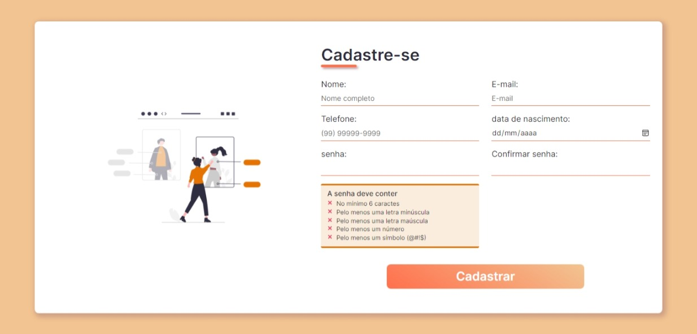

# Validação de Formulário com Regex

Esta Aplicação consiste em utilizar **expressões regulares** (**regex**) para validar os valores inseridos nos campos do formulário.
Caso algum campo contenha um valor que não corresponde às especificações da regex, o formulário não será enviado.

**Desenvolvido com:** HTML, CSS e JavaScript

## Campos do formulário
### Nome
**Regex utilizada:** 
~~~ 
const nameRegex = /^[a-záàãâéêíóõôçñ ]+$/i 
~~~
O valor do campo **Nome** pode conter apenas letras maiúsculas e minúsculas, espaços e os caracteres especiais informados.

### E-mail
**Regex utilizada:** 
~~~ 
const emailRegex = /^[a-z0-9.-_]+@[a-z0-9.-_]+\.[a-z]{2,}$/i
~~~
O valor do campo **E-mail**, antes e depois do **@**, pode conter letras maiúsculas e minúsculas, números e os caracteres especiais informados. Depois do sinal de ponto (.) só é aceito no mínimo duas ou mais letras. Este campo não aceita espaço em branco.

### Telefone
**Regex utilizada:** 
~~~ 
const phoneRegex = /(\(?\d{2}\)?\s)?(\d{4,5}\-?\d{4})/g
~~~
O campo **Telefone** aceita somente números e não permite espaço em branco. Os parenteses, o DDD, o número de telefone móvel (9) e o traço (-) entre a primeira e a segunda parte do telefone são opcionais.

### Senha
**Regex utilizada:** 
~~~ 
 const lowerCaseRegex = /(?=.*[a-z])/
 const upperCaseRegex = /(?=.*[A-Z])/
 const numberRegex = /(?=.*[0-9])/
 const symbolRegex = /(?=.*[!@#$%&*^~+])/
 const voidRegex = /[ ]/
~~~
O valor do campo **Senha** deve conter no mínimo 6 caracteres, uma letra minúscula, uma letra maiúscula, um número e um símbolo. Este campo não aceita espaço em branco.

## Interface

